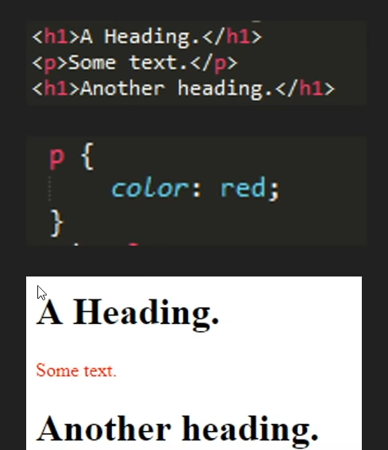
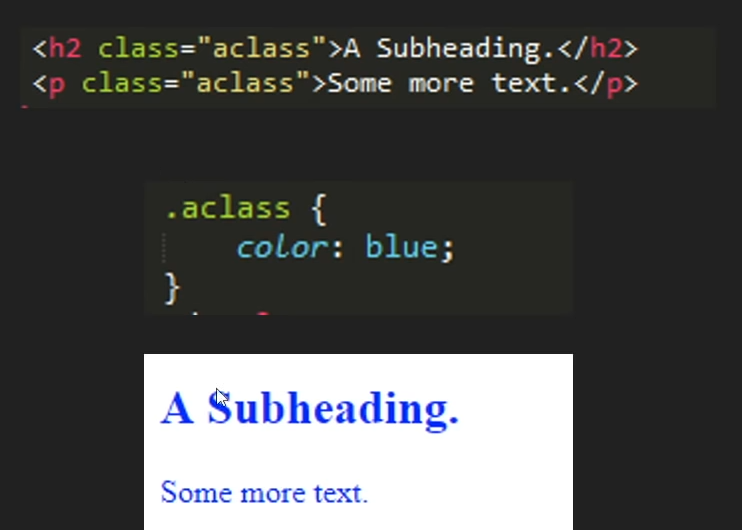
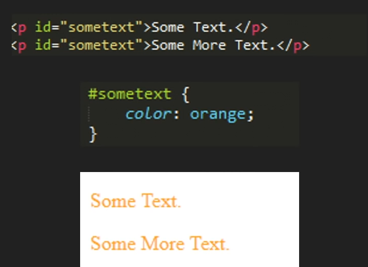

# Selector
- Selectors are ways of grabbing and manipulating HTML
- There are many different ways to select, however all turn out the same way
- Different selectors have different applications
- Types of selectors
	- Element selector
		- You can select entire elements without any special characters
		- This applies to all of these elements with that tag on the page
		- It ranks on the bottom of the speficity scale
		
	- Class selector
		- This is used to select elements with a certain class name
		- Can be used on any and all elements with that class
		- Can be used multiple times and is select with the `.` symbol
		
	- ID selector
		- This is used to select elements with a certain ID name
		- Can be used on any and all elements with that ID
		- Unlike classes, it can only be used on one element at a time and is selected with the `#` symbol. However, it is possible to use more than once.
		
## Specificity
- The selector with higher priority will be selected by css for styling.(which is more specific)
- Inline(style in the html file)>ID>Class>Element
